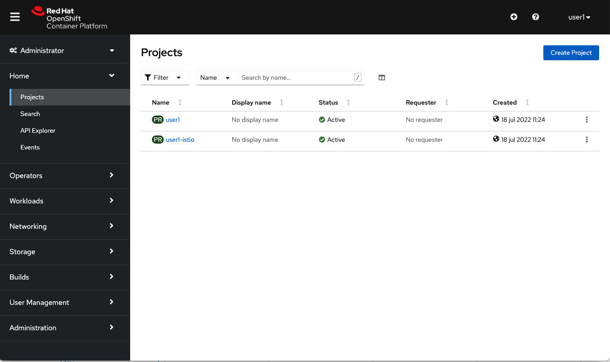
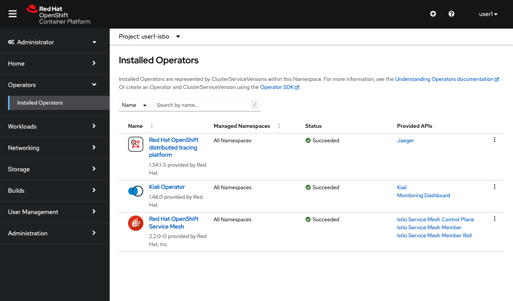
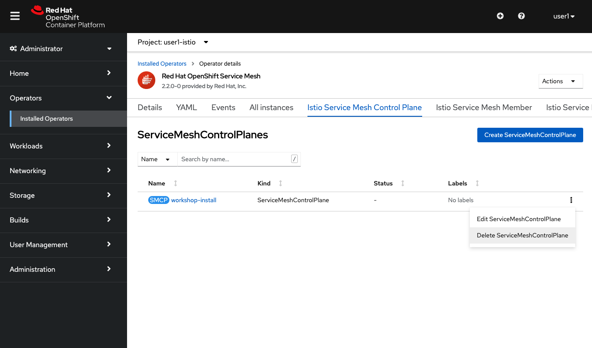
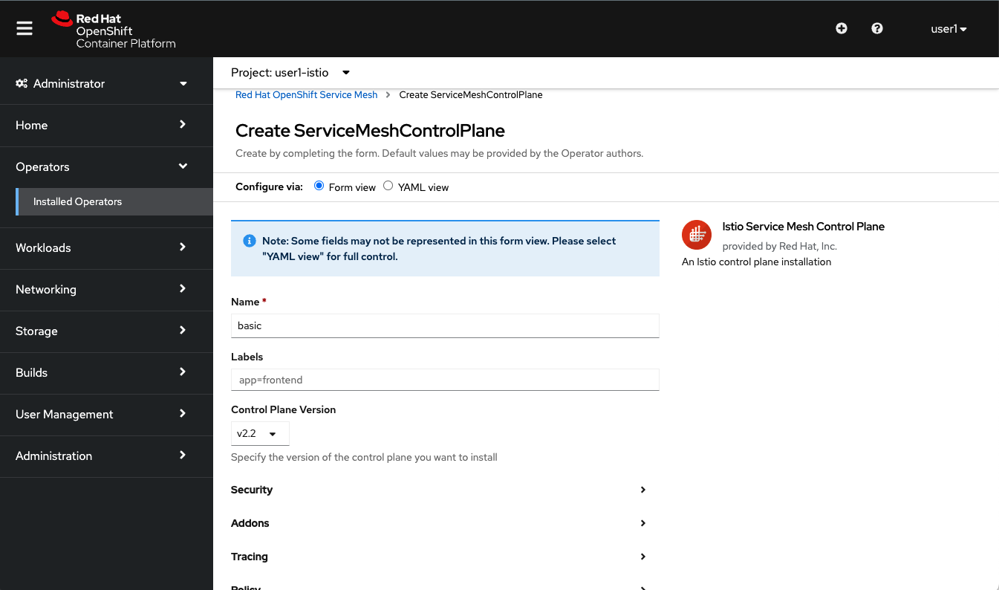
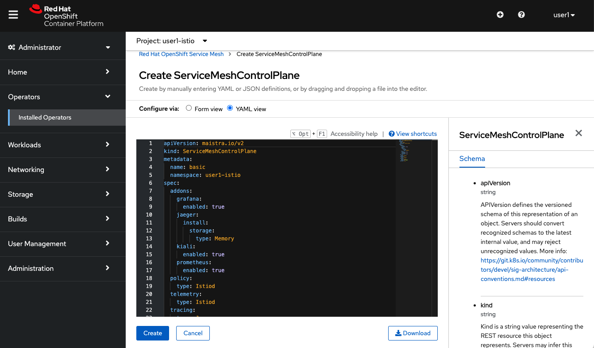

# Setup

You will conduct these labs in an OpenShift cluster.  First, test you have access to your cluster via console and CLI.

## OpenShift

<blockquote>
<i class="fa fa-desktop"></i> If you check the Console tab in your dashboard, you should see the following:
</blockquote>

<br/>
 *OpenShift Welcome*

<br>

You will use the OpenShift `oc` CLI  to execute commands for the majority of this lab.  


<blockquote>
<i class="fa fa-terminal"></i> You should already be logged in to your cluster in your web terminal.
</blockquote>

Switch to the **Terminal** tab, and try running:

```execute
oc whoami
```
*You can click the play button in the top right corner of the code block to automatically execute the command for you.*

You should see your username: %username%.

The instructor will have preconfigured your projects for you.

<blockquote>
<i class="fa fa-terminal"></i> List your projects:
</blockquote>

```execute
oc projects
```

You should see two projects: your user project (e.g. '%username%') and '%username%-istio'.  

<br>

<blockquote>
<i class="fa fa-terminal"></i> Switch to your user project.  For example:
</blockquote>

```execute
oc project %username%
```

<br>

Let's take a look at the project.

<blockquote>
<i class="fa fa-terminal"></i> List the pods in the project:
</blockquote>

```execute
oc get pods
```

Output (sample):

```
NAME                                    READY   STATUS    RESTARTS   AGE
rhsso-operator-xxxxxxxxx-xxxxx          1/1     Running   0          15h
```

The RH-SSO operator will be used later in the security labs.

<br>

## Application Code
Next we need a local copy of our application code.

<blockquote>
<i class="fa fa-terminal"></i> Clone the repository:
</blockquote>

```execute
git clone https://github.com/RedHatGov/service-mesh-workshop-code.git
```

<blockquote>
<i class="fa fa-terminal"></i> Checkout the workshop-stable branch:
</blockquote>

```execute
cd service-mesh-workshop-code && git checkout workshop-stable
```

## Istio
Istio should have been installed in the cluster by the instructor.  Let's make sure it is running in the cluster.  

The %username%-istio project is a service mesh dedicated to you.

<blockquote>
<i class="fa fa-terminal"></i> List the pods in the service mesh project:
</blockquote>

```execute
oc get pods -n %username%-istio
```

<blockquote>
<i class="fa fa-terminal"></i> There is no pods get. The instructor failed in the service-mesh installation. But don't worry about it, we are going to re-install everything in your project with a few clicks :
</blockquote>

## Installing Openshift Service Mesh
The installation process is managed by an Operator, so through a CRD (Custom Resource Definition -a configuration in a YAML fashion/structure) we a re going to define all the service mesh components that we'll require to deploy.

1. First go to Openshift Web Console and log in with your credentials.

2. Go to "Administrator" view > Projects and select (clic on) the project %username%-istio
<br/>

3. Then select from the left menu <b>Operators > Installed Operators</b>, and then clic on "Red Hat Openshift service Mesh" operator.
<br/>

4. Now we are going to delete the actual CRD and replace it with a new one. So first just delete the actual CRD from the "Istio Service Mesh Control Plane" tab, then clic on the dots to show the options available for this configuration as is shown in the picture below, click in the "Delete" option and then confirm:

<br/>

5. Clic in the "Create ServiceMeshControlPlane" button in order to open the form that will guide us to deploy a new Service Mesh Control Plane in our project.
<br/>

6. We are just going to left everything by default. In a production  environment we can modify any value on the fly if needed (limit/expand cpu and mem resources, activate persistence and so on). So just clic in the  "Create" button.
<br/>

With these simple steps we just get deployed an entire service mesh control plane, Kiali, Jaeger, Prometheus and Grafana. Everything is integrated and configured to work together as one solution.

Now execute this command to get the pods in the project:

```execute
oc get pods -n %username%-istio
```


Output:

```
NAME                                      READY   STATUS    RESTARTS   AGE
grafana-xxxxxxxxx-xxxxx                   2/2     Running   0          5h30m
istio-egressgateway-xxxxxxxx-xxxxx        1/1     Running   0          5h30m
istio-ingressgateway-xxxxxxxxx-xxxxx      1/1     Running   0          5h30m
istio-telemetry-xxxxxxxxx-xxxxx           2/2     Running   0          5h25m
istiod-workshop-install-xxxxxxxxx-xxxxx   1/1     Running   0          5m28s
jaeger-xxxxxxxxxx-xxxxx                   2/2     Running   0          5h25m
kiali-xxxxxxxxxx-xxxxx                    1/1     Running   0          5h25m
prometheus-xxxxxxxxx-xxxxx                2/2     Running   0          5h30m
```

The primary control plane component is the Istio daemon `istiod`.  `istiod` handles [Traffic Management][1], [Telemetry][2], and [Security][3].  The `istio-ingressgateway` is a load balancer for your service mesh.  You will configure this with a microservices application in the next lab.

[1]: https://istio.io/docs/concepts/traffic-management/
[2]: https://istio.io/docs/concepts/observability/
[3]: https://istio.io/docs/concepts/security/
